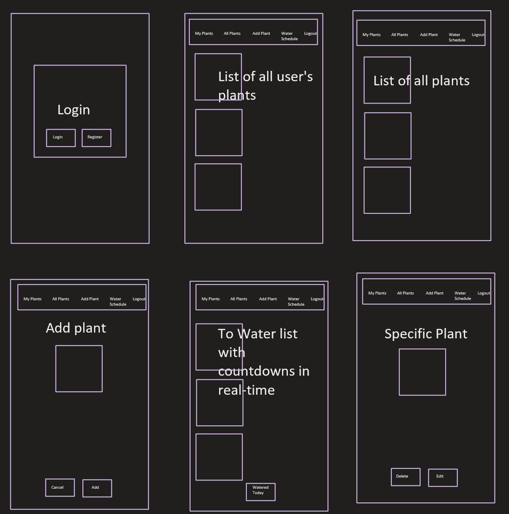
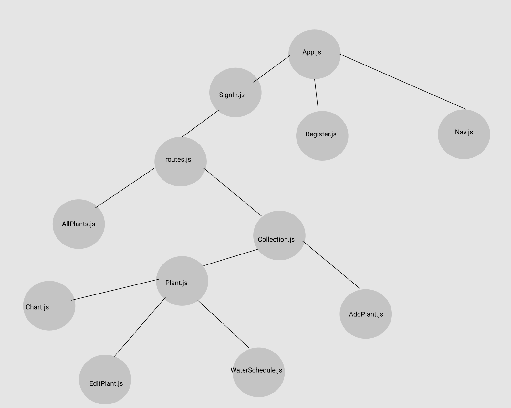

# Plantsiful App plantsiful.com

## Idea and User:
More people are discovering the joys of owning plants due to social media. #urbanjungle According to the National Gardening Association, houseplant sales in the U.S. have increase 50% to $1.7 billion in the last three years. This increase in plant ownership has also lead to an increase in preventable plant deaths. While it may sometimes seem that houseplants just love to die, the good news is that plants don't really die without a reason. In truth, houseplants are fairly predictable, depending on the species, and just a handful of reasons are responsible for the principle part of houseplant attrition. The top factors for houseplant casualties are too much water, poor drainage, not repotting, using old potting soil, not enough water, and/or fertilizer issues. 

To support new and experienced plant lovers alike, Plantsiful is a plant care management app designed with plant-parent convenience in mind. Now tracking plant biometrics is as enjoyable as the care itself, letting anyone be a triumphant plant owner. Navigation is made simple and intuitive by allowing users to navigate easily though out the app using a stationary navigation section with icons. 

## Features:
### Current features include:
Users are able to sign in or register. Users will receive an email notification confirming their registration.
App includes the capability to create unique plant profiles with watering schedules. Plant profiles include an image of the plant, common name of plant, scientific name of plant, special instructions, and customizable watering schedule. 
App keeps track of each plant's watering schedule and provides notifications to water right to the user's phone. 
Plants are organized by when they need to be watered which includes care instruction notes for easy reference.

### Future features will include:
- Updated plant profile that includes plant's location, acquisition date, fertilizer specifics and schedule, rotation log, photo gallery with timestamps and comments to track growth/damage/disease.
- Plants will be searchable by common name, scientific name, location.
- Users will have access to an in-app plant store where they can purchase new varieties of plants to add to their collection. Display plants from Trefle (global plant API).
- Plant growth will be charted over time using input of measurements and unique plant biometrics. 
- Virtual house map with interactive location of each plant.

## App Colors:

## View/ Controller:
### Wireframe:

### Component Tree:

### SignIn.js (View) 
- This is the Sign in page where the user will be able to Sign into their already existing account. It will handle authentication. Below is a route to the register page if the user needs to register. 
 

### Register.js (View)
- This is the Register page where the user will be able to register a new account and then be redirected back to the login component. This component will have similar functionality as SignIn.

### Collection.js (View)
- This will be the first screen when a user is successfully logged in. It will show a navbar with five icons for view pages, "Collection, Add, Plant Metrics, Shop, Profile." A list of plant profiles will be displayed centered on the screen. The navbar will persist no matter what view user is in.

## Endpoints
URL, REST methods, and a sample of the data that is being sent or received for every endpoint in the application are listed here.

### Auth Endpoints
- POST: push a new user to the database.     app.post('/auth/register', authCtrl.register)
- POST: push an existing user to the database.     app.post('/auth/login', authCtrl.login)
- GET: this will get the user from the database to login in.     app.get('/auth/user', authCtrl.getUser)
- DELETE: Can logout of the website.     app.delete('/auth/logout', authCtrl.logout)
- PUT: Can update the username or profile picture. app.put('/auth/user', authCtrl.updateUser)

### User Plant Collection Endpoints 
- GET: This will get all user specific plants because we are already logged in. app.get(`/api/plants`, cardCtrl.getPlants)
- GET: This will get all user specific plants because we are already logged in. app.get(`/api/plants/:id`, cardCtrl.getPlant)
- POST: will add new plant to the list of plants in the User's collection. app.post(`/api/plants`, cardCtrl.addPlant)
- DELETE: Can delete plant from the list of plants in the User's collection. app.delete(`/api/plants/:id`, cardCtrl.deletePlant)
- PUT: Can edit plant in the list of plants. app.put(`/api/plants/:id`, cardCtrl.editPlant)

#### Store Endpoints
- GET: This will get 10 random plants from the plant API. app.get(`https://trefle.io/api/plants/{id}`, storeCtrl.getPlants)

#### Chart Endpoints 
- GET: This will get the chart? 
- POST: The line chart will update when plant biometrics are added to the database. 

## Schema (Database Design):
	• roles table
		○ role_id serial primary key
		○ name varchar(25)
	• users table
		○ user_id serial primary key
		○ email varchar(255)
		○ hash text
		○ role_id int references roles(roles_id)
	• users_info table
		○ info_id serial primary key
		○ first_name text
		○ last_name text
		○ user_id int references users(user_id)
	• user_plants table
		○ plant_id serial primary key 
		○ common_name text
		○ scientific_name text
		○ note text
		○ image varchar(1000)
		○ water_interval int 
		○ user_id int reference users(user_id)
        ○ timestamp of water - interval of how many minutes between watering
    • plants table
		○ id serial primary key 
		○ common_name text
		○ scientific_name text
		○ note text
		○ image varchar(1000) -->
    • need to update if adding shopping cart functionality
    • need to update if adding location functionality

## Routes:
        <Route exact path = '/' component = {Collection} />  (Dashboard)
        <Route path = '/store' component = {AllPlants} />
        <Route path = '/plant/:id' component = {Plant} />
        	<Route path = '/plant/:id/chart' component = {Chart} />
       		<Route path = '/plant/:id/edit' component = {EditPlant} />
        	<Route path = '/plant/:id/water' component = {WaterSchedule} />
        <Route path = '/add' component = {AddPlant} />
		<Route path = '/register' component = {Register} />

## Point Plan:
o	3+ responsive views (10)

o	React hooks on 5 components (10)

o	Functioning Authentication (10)

o	Hosting (15)

o	Sass/Less (10)

o	Node Mailer (10)

o	ChartJS (5)

